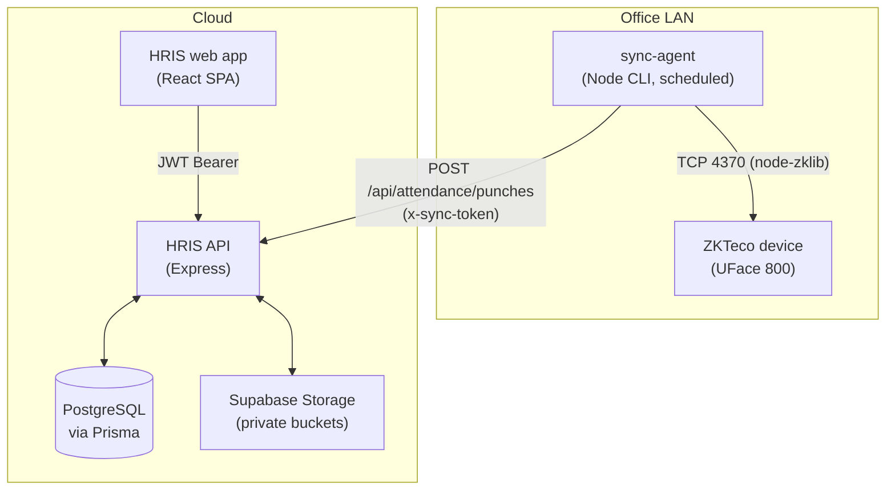

# Brandigade HRIS & Biometric Attendance System

Full-stack HRIS for Brandigade: employee records, org chart, request workflows,
campaign & SDR performance, commission slabs, spiffs, loans, biometric
attendance, and monthly payroll with PDF payslips.

- **Backend** — Express 4 on Node 22+, Prisma 5, PostgreSQL (Supabase)
- **Frontend** — React 19, Vite, Tailwind 4, React Router 7, Recharts
- **Sync agent** — Node CLI that runs on the office LAN and pushes ZKTeco punches to the API

---

## Architecture



The API never reaches into the office network. The agent runs there and pushes;
everything else is cloud-side.

---

## Getting started

### 1. Backend

```bash
cd backend && npm install && cp .env.example .env
```

Fill in `.env` — at minimum `DATABASE_URL`, `DIRECT_URL`, `JWT_SECRET` and
`JWT_REFRESH_SECRET`. There are **no fallback secrets**: in production the server
refuses to start without them, and in development it warns and uses a random
per-boot secret. Generate one with:

```bash
node -e "console.log(require('crypto').randomBytes(48).toString('hex'))"
```

Then push the schema, create the first admin, and start:

```bash
cd backend && npx prisma migrate deploy && npm run seed && npm run dev
```

`npm run seed` prints a generated admin password once (or uses `ADMIN_PASSWORD`
if you set one). Either way the account must change it at first sign-in.

### 2. Frontend

```bash
cd frontend && npm install && npm run dev
```

`VITE_API_URL` in `.env.local` points at the API. `VITE_GOOGLE_CLIENT_ID` must
match the backend's `GOOGLE_CLIENT_ID` — Google sign-in verifies the ID token
against it and is rejected if they differ.

### 3. Verify

```bash
cd backend && npm run smoke
```

Boots the API on a spare port and runs 54 end-to-end checks — auth, RBAC,
attendance, requests, payroll and the audit trail — against the configured
database, then deletes everything it created.

---

## Modules

### Authentication
- JWT access + refresh tokens, refresh rotated on every use and revocable.
- **Google SSO** via verified ID token. The server verifies the token against its
  own client ID; the identity never comes from the request body.
- Sign-in and password change are rate limited per IP.
- **First-login password change** is enforced: accounts are created with a
  temporary password and every route except the change itself returns
  `PASSWORD_CHANGE_REQUIRED` until it is replaced.
- Sync agent authenticates with `x-sync-token`, compared in constant time.

### Employees & org chart
- Full profiles: code, designation, phone, bank details, emergency contact,
  shift window, grace minutes, biometric `zkUserId`.
- Manager relationships render as a collapsible org chart (`/dashboard/org-chart`).
  Reporting loops are rejected on save.
- Salary changes are appended to `SalaryHistory` with reason and effective date.
- Non-admins may edit only their own phone, birthday, emergency contact and bank
  details; everything else is admin-only.

### Attendance
- Punches arrive from the sync agent or a direct TCP pull, and are merged per
  employee-day: earliest punch is check-in, latest is check-out.
- **All date and lateness maths runs in `TIMEZONE`** (the office zone), never the
  server's, so a UTC host scores a Karachi office correctly.
- Late, early-departure and overtime minutes are derived from each employee's own
  shift and grace period.
- Approved leave / WFH / half-day decisions are not overwritten by a stray punch.
- Admins can override any employee-day, including check-out.

### Requests
- Leave (annual / sick / casual / unpaid), half-day, and WFH.
- Overlapping requests for the same dates are rejected.
- Approval writes the matching attendance rows automatically.
- Approving or rejecting notifies the employee.

### Campaigns, commissions & spiffs
- Campaigns hold members (team lead + SDRs), a monthly show-up target, and
  versioned commission structures. Only one structure is active per campaign.
- Slab types: `per_showup`, `fixed_monthly`, `percentage`, `hybrid`. Overlapping
  slab ranges are rejected before they can change anyone's pay.
- **Payroll and the campaign dashboard share one commission engine**
  (`utils/commission.js`), so the figure a lead sees matches their payslip.
- The Team Lead ladder and the campaigns it applies to are configurable via
  `TEAM_LEAD_COMMISSION_LADDER` / `TEAM_LEAD_LADDER_CAMPAIGNS`.
- Spiffs are awarded by admins and flow into the next payroll run.

### Loans & advances
- Approval requires a repayment month/year, and refuses periods whose payroll is
  already finalized — otherwise the deduction would never happen.

### Payroll
- Computes base salary, attendance and punctuality allowances, unpaid-leave and
  lateness deductions, loan repayments, spiffs, bonuses and commission.
- **A finalized period cannot be recalculated.** Issued payslips are a financial
  record; `POST /api/payroll/run` returns 409 for a finalized month.
- Payslip PDFs stream from an authenticated endpoint. Employees see only their
  own, and only once the run is finalized.
- Allowance amounts and the lateness threshold are environment settings, not
  constants in the code.

### Notifications & audit
- In-app notifications for request decisions, spiff awards and payslip
  availability; admins are notified of new requests.
- Every administrative action is audited with the actor, entity and a redacted
  detail payload (credentials are stripped). The trail is keyset-paginated and
  survives deletion of the account that created it.

---

## Role-based access

| Feature | Admin / CEO / COO | Team Lead | SDR / Employee |
| :--- | :---: | :---: | :---: |
| Employees & salaries | Full | Team members (no salary history) | Self only |
| Org chart | Full | Full | Full |
| Approve requests | Yes | **No** — read-only for their team | Submit only |
| Attendance | All + manual override | Team members | Self only |
| Campaigns & performance | Full | Own campaign | Own campaign |
| Commission structures | Full | Active structure only | Active structure only |
| Award spiffs | Yes | No | No |
| Payroll | Full | No | Own payslips only |
| Audit log & digital twin | Full | No | No |

Enforced in the API on every request, and mirrored by route guards in the SPA so
a role never lands on a page it cannot use.

> **Note:** Team Leads cannot approve requests. Earlier documentation claimed
> they could, but the API has always rejected it; the UI now matches.

---

## Database

Prisma with PostgreSQL. The schema lives in `backend/prisma/schema.prisma` and
the baseline migration in `backend/prisma/migrations/`.

```bash
npx prisma migrate deploy   # apply migrations
npx prisma migrate dev      # create a migration after editing the schema
npx prisma studio           # browse data
```

All tables have row-level security enabled with no policies. The app connects as
the table owner and bypasses RLS; this exists to block PostgREST, which would
otherwise expose every table (including `User.passwordHash`) to anyone holding
the project's anon key.

Both storage buckets (`payslips`, `employee-documents`) are **private**. Payslips
stream through an authenticated endpoint and documents through short-lived signed
URLs.

---

## Deployment

One Node app on cPanel serves both the API and the built front end, so there is
a single origin and no CORS in production.

### 1. Build the front end

cPanel will not run a build for you, so produce `frontend/dist` first — locally
or in cPanel's terminal:

```bash
cd frontend && npm ci && npm run build
```

`.env.production` sets `VITE_API_URL=/api`. `VITE_GOOGLE_CLIENT_ID` must match
`GOOGLE_CLIENT_ID` in `backend/.env` — Google sign-in verifies the ID token
against it and fails if the two diverge.

### 2. Upload and configure

Upload `backend/` and `frontend/dist` keeping their relative positions, or set
`FRONTEND_DIST` to wherever `dist` ended up.

1. Node 20.x or 22.x, application root `backend`, startup file `src/server.js`.
2. Set every variable from `.env.example` in the host's environment panel.
   Set `NODE_ENV=production` — this makes missing secrets fatal rather than silent.
3. `npm ci --omit=dev && npx prisma migrate deploy && npm run seed`.

`npm install` runs `prisma generate` through the `postinstall` hook, so the
client is built on every deploy.

The server sits behind a proxy, so `trust proxy` is enabled and rate limiting
keys off the forwarded client IP. Helmet's CSP allows `accounts.google.com` for
script, frame and connect — **test both sign-in paths immediately after
deploying**, since a CSP mistake only shows up in the browser.

### 3. Scheduled biometric pull (optional)

Passenger idles the process between requests, so in-app timers do not fire.
`POST /api/system/cron/sync` runs the pull instead, authenticated by the sync
token:

```bash
curl -s -X POST https://hris.brandigade.com/api/system/cron/sync -H "x-sync-token: $SYNC_AGENT_TOKEN"
```

This only does anything where the API can reach the ZKTeco device, which shared
hosting cannot. Leave `ENABLE_DIRECT_ZK_SYNC=false` in production and let the
office sync agent push punches instead.

### Sync agent (office machine)

```bash
cd sync-agent && npm install
```

`sync-agent/.env`:

```env
HRIS_API_URL=https://hris.brandigade.com/api
SYNC_AGENT_TOKEN=<must match the backend>
ZKTECO_IP=192.168.1.100
ZKTECO_PORT=4370
LOOKBACK_DAYS=3
```

Schedule `node index.js` every 10 minutes (Task Scheduler or cron). Overlapping
runs are safe — the server upserts, so re-sending punches changes nothing.
`npm run full-sync` backfills a longer window.

---

## License

Internal use at Brandigade. All rights reserved.
